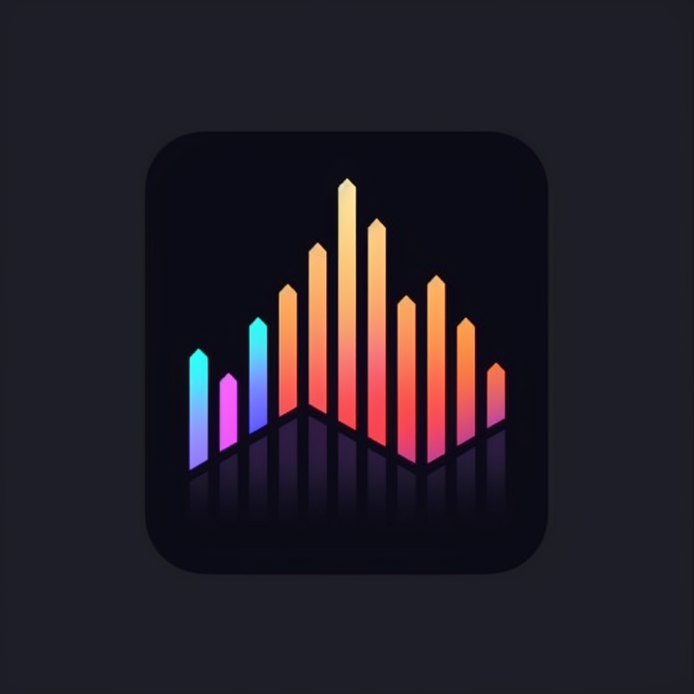

# OpenSignal

OpenSignal is a game-changing open-source app designed to empower retail investors and revolutionize the way they access market data and collaborate with the investing community. With real-time market data, interactive charts, community-driven insights, and a host of other features, OpenSignal equips investors with the tools they need to make informed decisions and enhance their trading strategies.

## Key Features

- **Real-time Market Data**: Stay ahead of the game with OpenSignal's comprehensive real-time market data. From stock prices and indices to commodities and currency exchange rates, the app ensures you have access to the latest information at your fingertips.

- **Interactive Charts and Visualizations**: Dive deep into market analysis with OpenSignal's interactive charts and visualizations. Analyze historical and real-time data, identify trends, and make accurate predictions for better investment choices.

- **Community-Driven Insights**: Join a vibrant community of retail investors and tap into the collective intelligence of the OpenSignal platform. Share your insights, discuss investment opportunities, and gain valuable feedback to stay on top of market conditions.

- **User-Generated Watchlists**: Create personalized watchlists tailored to your preferences. Track the performance of your favorite stocks, indices, or financial instruments, and receive real-time notifications for significant market events.

- **Sentiment Analysis**: Harness the power of sentiment analysis to gauge market sentiment based on social media and news data. By understanding market trends and sentiments, you can make more informed investment decisions.

- **Portfolio Tracking**: Manage your investment portfolios effortlessly. Input and monitor your holdings, view performance metrics, and receive personalized alerts and recommendations to optimize your portfolio strategy.

- **News and Analysis**: Stay informed with curated news articles, financial analysis, and market insights from trusted sources. OpenSignal keeps you updated with the latest happenings that may impact your investments.

- **Customizable Alerts**: Set up personalized alerts to stay on top of critical developments. Whether it's price alerts, technical indicators, news events, or market condition changes, OpenSignal ensures you never miss important opportunities.

- **Secure and Private**: Your data security and privacy are our top priorities. OpenSignal implements robust encryption protocols and follows industry best practices to safeguard your information and transactions.

- **Open-Source Contribution**: Join the developer community and contribute to the growth of OpenSignal. Leverage our open-source framework to build plugins, integrate additional data sources, and enhance the app's functionality.
